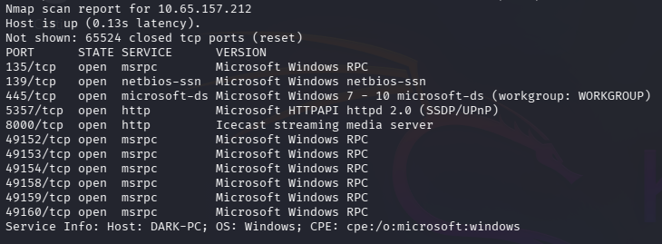
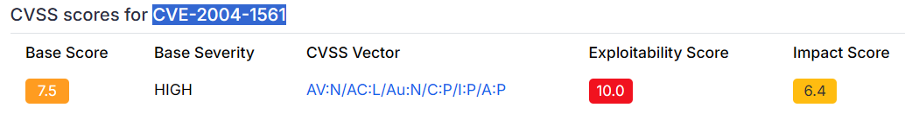
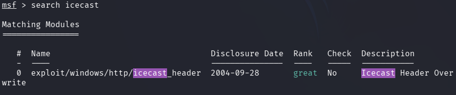
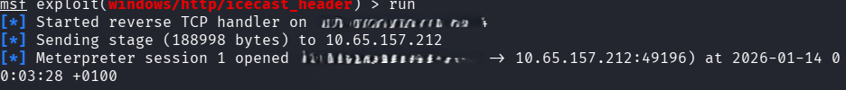
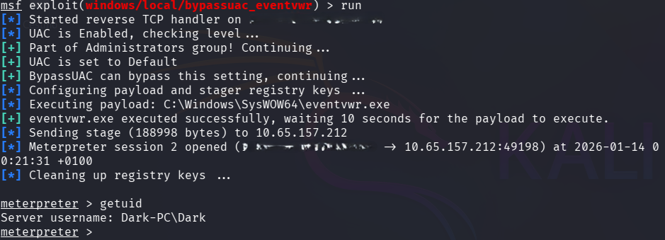
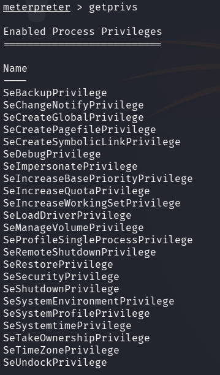
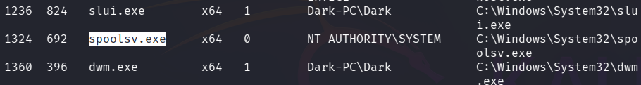
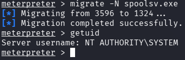
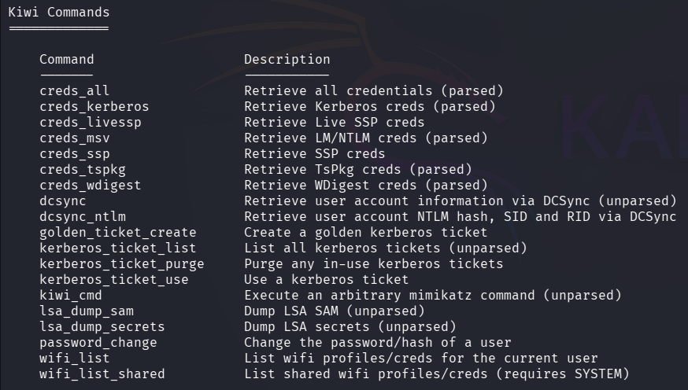
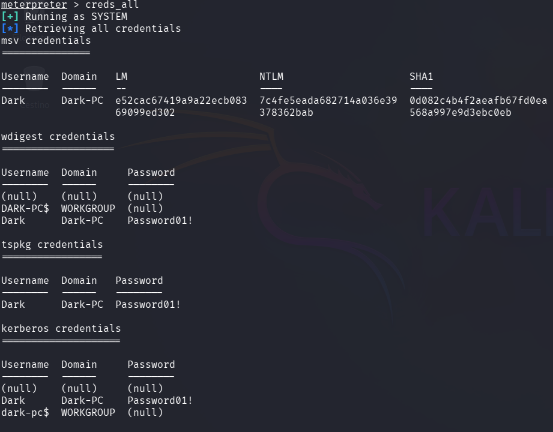

# 🖥️ Machine 02 — Ice

## 📌 Overview
Ice is a beginner‑level TryHackMe machine that leverages a vulnerable Icecast service to gain 
RCE and escalate privileges on a Windows host.

---

## 🔍 Enumeration

### 🔸 Nmap Scan

```nmap -sS -sV -n -Pn -p- -oN scan.nmap 10.65.157.212```



The scan reveals Icecast running on port 8000. After a bit of research, we confirm that the service is vulnerable to **CVE‑2004‑1561**, a known remote code execution flaw. 




### 🔸 Key Findings
- Icecast service running in port 8000  
- Vulnerability CVE-2004-1561    

---

## 🛠️ Tools Used
- **Nmap** — Network scanning    
- **Metasploit Framework** — Exploitation    

---

## 🎯 Exploitation

Using Metasploit, we search for available modules.



Set RHOST and LHOST and run 



---

## 🚀 Privilege Escalation

Once we obtain a shell and answer the three questions, the author provides an additional piece of advice: "While this doesn't work the best on x64 machines, let's now run the following command 
`run post/multi/recon/local_exploit_suggester`. 
*This can appear to hang as it tests exploits and might take several minutes to complete*"

Although the official room instructs us to use the first exploit in the list, the correct one in my case is number 2.


After gaining access, we background our session, select the exploit, set the `session_id` and `LHOST` values as needed and run.



Back in the shell, using the `getprivs` command, we enumerate all the current user’s privileges.



The SeTakeOwnershipPrivilege entry is the one we’re interested in.

Using `ps`, we migrate into a process running under NT AUTHORITY\SYSTEM. We’ll use spoolsv.exe  since it runs under the same architecture as lsass, and we can restart it if needed.



`migrate -N $name_process`




At this point, **we are now NT AUTHORITY\SYSTEM**.

---

## 📂 Loot & Flags

We use the `load kiwi` command, an updated version of Mimikatz. With `help` we access Kiwi’s available commands



and we use `creds_all` to retrieve all credentials



For manual exploitation https://www.exploit-db.com/exploits/568

There are no flags on this machine; the objective is to escalate privileges up to NT AUTHORITY\SYSTEM. With Mimikatz/Kiwi we can perform various persistence techniques, although they are out of scope for this machine.

---

## 🛡️ Defensive Takeaways
- Legacy services like Icecast must be decommissioned or updated, as they often contain critical RCE vulnerabilities.  
- Lack of privilege separation allows full compromise immediately after exploitation, highlighting the need for proper service hardening and least‑privilege configurations.  
- Credential dumping protections (LSASS protection, AV/EDR, restricted token access) should be enforced to prevent tools like Mimikatz/Kiwi from retrieving sensitive credentials.  
  

---

## 🧠 Lessons Learned
- Even simple RCE exploits can grant SYSTEM-level access when services run with excessive privileges.  
- Post-exploitation enumeration remains essential, even when privilege escalation is not required, to validate the impact and extract credentials.  
- Process migration and credential extraction techniques are valuable skills for understanding real-world attack paths and defender blind spots.  

