# 🖥️ Machine 04 — Kenobi

## 📌 Overview

Kenobi is a Linux machine focused on enumerating SMB and ProFTPD services, exploiting insecure configurations, and achieving privilege escalation through abuse of vulnerable SUID binaries.

---

## 🔍 Enumeration

### 🔸 Nmap Scan

Several ports are open, but we are interested in two ports: 111 (rpcbind) and 139 (SMB). By enumerating port 111, we discover that we can mount the /var directory.


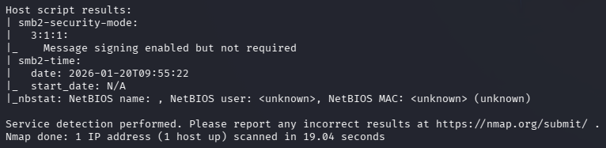

When enumerating SMB, we access the anonymous share, which contains log.txt.

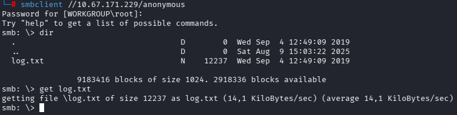

From there, we identify the user 'kenobi' and the location of his RSA key.

Now we test connecting to the FTP server using netcat

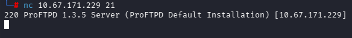

We use searchsploit to look for potential entry points

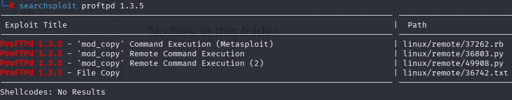

Author's comment: "The mod_copy module implements SITE CPFR and SITE CPTO commands, which can be used to copy files/directories
from one place to another on the server. Any unauthenticated client can leverage these commands to copy files
from any part of the filesystem to a chosen destination."

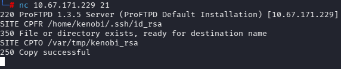

Next, we mount /var and navigate to the location of Kenobi’s RSA key, copy it, and disconnect

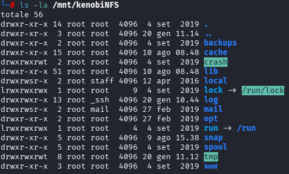

### 🔸 Key Findings
- rpcbind (port 111) exposes NFS services, allowing us to enumerate and locally mount the /var directory through mountd and nfs RPC programs  
- SMB share anonymous is accessible without authentication, revealing log.txt, which discloses the user kenobi and the location of his RSA private key  
- ProFTPD 1.3.5 is vulnerable to a file-copy exploit, enabling us to move files across the filesystem and place the RSA key into a mountable directory for extraction  

---

## 🛠️ Tools Used
- **Nmap** — Network scanning  
- **SMBclient** — SMB enumeration   
- **Netcat** — Shell handling  
- **searchsploit** — Local exploit database lookup

---

## 🎯 Initial Access

With the id_rsa key, we connect via SSH

```ssh -i id_rsa kenobi@IP```


---

## 🚀 Privilege Escalation

To escalate privileges, we must use the path hijacking technique. This occurs when a binary is executed without specifying its full path, allowing us to replace the file it attempts to run by placing our own version earlier in the PATH. As a result, the system will execute our malicious file instead of the legitimate one.

By trying with `sudo -l` we find out that we are not in sudoers, so we should try with binaries with SUID

```find / -perm -u=s -type f 2>/dev/null```

The binary `/usr/bin/menu` catches our attention

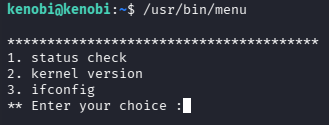

Upon reviewing the binary, we found that it executes commands without the absolute path

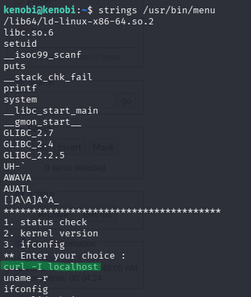

This means that if we create a file with a revshell, place it earlier in the path, and execute it, it will find our malicious file first and give us a root shell

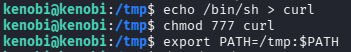

And we are root

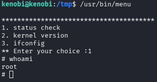
  

---

## 📂 Loot & Flags
- In Kenobi's folder we found user.txt


  
- In root's folder we found root.txt

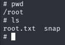
  
  

---

## 🛡️ Defensive Takeaways
- Disable or restrict unnecessary services like ProFTPD, SMB, or NFS should not be publicly exposed unless strictly required. Reducing the attack surface is essential  
- Keep software updated. ProFTPD 1.3.5 contains known vulnerabilities (mod_copy). A simple update would have prevented the exploitation vector  
- Any SUID program that executes commands without full paths (system("curl")) becomes vulnerable to PATH hijacking. Developers should use absolute paths and avoid system() whenever possible  
- Shares with anonymous access or overly permissive configurations make it easy for attackers to retrieve sensitive information  

---

## 🧠 Lessons Learned
- Enumeration is the most critical phase. The entire exploitation path in Kenobi depends on correctly identifying services, versions, and weak configurations. Without strong enumeration, exploitation is impossible  
- PATH hijacking is simple but extremely powerful, a basic mistake like not using absolute paths can lead directly to root access. It’s a strong reminder of the importance of secure coding practices
- Obtaining the RSA key only grants a low‑privileged user. True compromise requires understanding how to escalate to root  
